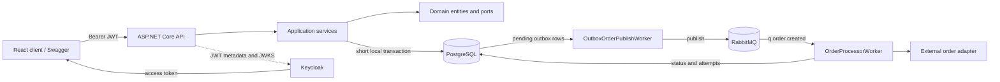

# Santa Cruz Challenge

Asynchronous order processing API built for the Grupo Santa Cruz .NET 8 code challenge.

The solution emphasizes short local database transactions, an outbox boundary, asynchronous processing, explicit contracts, and a replaceable external integration adapter.

## Architecture



### Projects

- `StaCruzChallenge.Api`: HTTP controllers, middleware, JWT configuration, Swagger, and composition root.
- `StaCruzChallenge.Application`: use cases, DTOs, service contracts, and the current-user abstraction.
- `StaCruzChallenge.Domain`: entities, enums, and repository ports. It has no dependency on Infrastructure.
- `StaCruzChallenge.Infrastructure`: Dapper repositories, PostgreSQL connection factory, RabbitMQ publisher, external adapter, and workers.
- `StaCruzChallenge.Tests`: focused unit tests for the required business scenarios.

The dependency direction is:

```text
API -> Application -> Domain
Infrastructure implements Application/Domain ports
```

## Processing Flow

1. The client authenticates with Keycloak and receives an access token.
2. `POST /api/orders` validates the request and obtains the user ID from the JWT `sub` claim.
3. The API reads prices from the persisted catalog. Prices are never accepted from the request payload.
4. The order, items, and one `Pending` outbox message are committed in one short local PostgreSQL transaction.
5. The API returns `202 Accepted` without waiting for the external integration.
6. `OutboxOrderPublishWorker` claims old pending outbox rows and publishes an event to RabbitMQ.
7. `OrderProcessorWorker` consumes the order event, calls the simulated external adapter asynchronously, records every attempt, and updates the order status.

### Outbox recovery settings

The development configuration contains two related retry controls:

```json
"OutboxOrder": {
  "PollingInterval": 10,
  "BatchSize": 10,
  "ForgottenMessagesIntervalMinutes": 0
},
"ProcessingAttempt": {
  "MaxRetryAttempts": 20
}
```

`ForgottenMessagesIntervalMinutes` controls which outbox rows the publisher scans:

- `0`: scan only rows with status `Pending`. These are newly-created orders that have not yet been handed to RabbitMQ.
- Greater than `0`: scan rows that are not `Completed` and whose creation time is at least that many minutes old. This recovers stuck `Processing`/`Enqueued` rows and publishes them to RabbitMQ again so `OrderProcessorWorker` can retry them.

The recovery interval is deliberately configurable. A small positive value is useful for local failure testing; production should choose a value longer than normal publish/processing time to avoid unnecessary duplicate deliveries.

`ProcessingAttempt:MaxRetryAttempts` is set to `20`, matching the RabbitMQ quorum queue policy in `docker/definitions.json`:

```json
"delivery-limit": 20
```

These limits apply at different layers. `MaxRetryAttempts` limits application-level calls to the external integration for an order. RabbitMQ's `delivery-limit` limits redeliveries of a message by the quorum queue. Keeping both at `20` makes the intended retry budget easy to explain and operate, but it is not an exactly-once guarantee. A crash between an external side effect and a database update can still require an idempotency key at the external integration boundary.

### Status flow

```text
Pending -> Processing -> Enqueued -> Completed
                         |
                         +-------> Failed
```

`Pending` is the initial outbox state. The publisher claims rows as `Processing`, publishes them to RabbitMQ, and marks successful publication as `Enqueued`. The order consumer then performs the external call. A successful call marks the order and outbox message `Completed`; an exhausted or failed flow is marked `Failed` and can be recovered according to the configured policy.

The external call happens outside any database transaction and no database connection is kept open while waiting.

## Transaction and Delivery Semantics

The outbox transaction guarantees that an accepted order and its event are committed together. It prevents the common failure where the order is persisted but the event is lost.

The workers use an at-least-once delivery model. A process crash between publishing an event and updating its database status can cause a duplicate delivery. The production version of the external adapter should accept an idempotency key, preferably the order ID or outbox message ID, and enforce it at the integration boundary.

`FOR UPDATE SKIP LOCKED` prevents multiple publisher instances from claiming the same outbox row concurrently during the claim transaction. It does not turn the external side effect into exactly-once processing.

## Database Model

The database uses incremental SQL scripts under `database/`, executed in numeric order:

```text
000_create_database.sql
001_create_products.sql
002_create_orders.sql
003_create_order_items.sql
004_create_outbox_orders.sql
005_create_order_processing_attempts.sql
006_create_indexes.sql
007_seed_products.sql
```

### Why orders use a numeric ID

`orders.o_id` is a `bigint` identity because it is a compact, human-comprehensive identifier for support, logs, and operational communication. It is easier to read aloud and search than a UUID while remaining independent from the external event identity.

UUIDs are used for product, item, outbox, and processing-attempt identities where distributed uniqueness and non-guessability are more valuable.

### Main relationships

```text
orders 1 --- N order_items
orders 1 --- N order_processing_attempts
orders 1 --- N outbox_orders (logical association through the event payload)
products 1 --- N order_items
```

The order item stores the catalog price at order creation time. This preserves the historical amount even if the product price changes later.

## Local Setup

Prerequisites:

- .NET 8 SDK
- Docker and Docker Compose
- PostgreSQL client or another SQL runner
- A Keycloak realm and test user

Start infrastructure from the repository root:

```bash
docker compose -f docker/docker-compose.yml up -d
```

Services:

| Service | Host address |
| --- | --- |
| API HTTP | `http://localhost:5269` |
| API HTTPS | `https://localhost:7024` |
| PostgreSQL | `localhost:5434` |
| RabbitMQ AMQP | `localhost:5673` |
| RabbitMQ management | `http://localhost:15673` |
| Keycloak | `http://localhost:8081` |

Apply the SQL scripts in order against the `product_orders` database. The Compose PostgreSQL container creates the `keycloak` database by default; create/configure the application database according to the connection string in `appsettings.Development.json`.

Build and run the API:

```bash
dotnet build StaCruzChallenge.Api/StaCruzChallenge.Api.csproj
dotnet run --project StaCruzChallenge.Api/StaCruzChallenge.Api.csproj --launch-profile https
```

Swagger is available at:

```text
https://localhost:7024/swagger
```

The local HTTPS certificate may require trusting the .NET development certificate or using `curl -k` during local testing.

## Keycloak

Create a realm named `santacruz` and a test user. Configure the API as an audience/client named `santacruz-api`, and ensure the access token contains that audience. The API authority is configured in `appsettings.Development.json`:

```json
"Keycloak": {
  "Authority": "http://localhost:8081/realms/santacruz",
  "Audience": "account",
  "RequireHttpsMetadata": false
}
```

For a cleaner production-style setup, configure the audience mapper and change `Audience` to `santacruz-api`.

The API validates JWT signatures using Keycloak's OpenID Connect metadata and JWKS endpoint. No Keycloak private key is stored in the API.

Swagger's **Authorize** button accepts the access token and sends it as:

```http
Authorization: Bearer <access-token>
```

Use an access token, not an ID token.

## API Contracts

```text
GET  /api/products
POST /api/orders
GET  /api/orders?pageNumber=1&pageSize=10
GET  /api/orders/{id}
```

Create-order request:

```json
{
  "items": [
    {
      "productId": "2a75bc20-0fee-43e5-bc4d-7313e5bf8396",
      "quantity": 2
    }
  ]
}
```

The response is `202 Accepted`:

```json
{
  "orderId": 42,
  "status": "Pending"
}
```

The authenticated user comes from the token. A client cannot choose another user by sending a user ID.

## Tests

Run the focused test project:

```bash
dotnet test StaCruzChallenge.Tests/StaCruzChallenge.Tests.csproj
```

The required scenarios are covered:

- Valid order creation uses the persisted product price, persists the order, and returns `Pending`.
- Empty orders, non-positive quantities, and unknown products are rejected without persistence.
- A failed integration updates the order to `Failed` and records an unsuccessful processing attempt.

## Operational Notes

- `FakeExternalOrderCaller` uses an asynchronous delay and configurable success/failure settings.
- `OrderProcessingAttempts` records attempt number, start/end timestamps, success, and error details.
- RabbitMQ declarations are in `docker/definitions.json`; the management UI is exposed on port `15673`.
- The API exception handler returns generic ProblemDetails for unexpected HTTP request failures and logs the trace ID.
- Background-service exceptions are logged by the host and should be monitored separately from HTTP errors.

## Production Follow-ups

This challenge intentionally keeps the implementation focused. Before production, I would add:

- A migration runner such as DbUp to track applied SQL scripts.
- An explicit outbox claim/lease policy for abandoned `InProgress` rows.
- Durable idempotency at the external integration boundary.
- Retry backoff and a dead-letter workflow with operational alerts.
- Structured logs and correlation IDs across HTTP, outbox, RabbitMQ, and integration calls.
- Integration tests using disposable PostgreSQL, RabbitMQ, and Keycloak containers.
- Secrets supplied through environment variables or a secret manager rather than committed development values.
